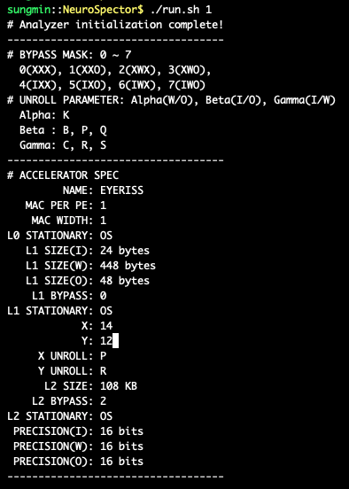

# NeuroSpector

## Build & Run
~~~bash
$ make -j                   # Build
$ ./run.sh                  # Run all layers
$ ./run.sh [layer # > 0]    # Run the selected layer
$ ./run.sh gdb              # Gdb
~~~

## Accelerator Spec

