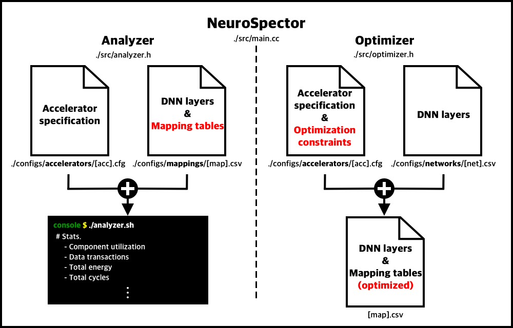

# NeuroSpector: Analytical Modeling and Optimization of DNN Computations on Accelerators

- Contributors: Sungmin Ryu (WheatBeer), Chanho Park (pch0561), Bogil Kim (bogilkim), and William J. Song (wjhsong)
- Intelligent Computing Systems Lab ([ICSL](https://icsl.yonsei.ac.kr/)), Yonsei University, Seoul, Republic of Korea (South)
- Current release: v0.0.0

## 0. Prerequisites & Build
- Compiler: g++ or Clang
- NeuroSpector uses *Makefile* to make an executable file. Just type the following command. 
~~~bash
$ make -j
~~~

## 1. Overview

## 2. Configurations
- Description of each configuration (e.g., accelerator, mapping table, and network) is in the [*configs*](./configs) folder. 

## 3. Analyzer
- *NeuroSpector analyzer* first takes an accelerator specification and mapping tables of multiple DNN layers, and checks whether the mapping tables are valid.
If the tables are valid, all the information comes out as follows.
- **(To appear more details)**
- Run
~~~bash
$ ./analyzer.sh                  # Run all layers
$ ./analyzer.sh [layer # > 0]    # Run the selected layer
$ ./analyzer.sh gdb              # Gdb
~~~

## 4. Optimizer
- **(To appear more details)**
- Run
~~~bash
$ ./optimizer.sh                 # Run all layers
$ ./optimizer.sh [layer # > 0]   # Run the selected layer
$ ./optimizer.sh gdb             # Gdb
~~~
