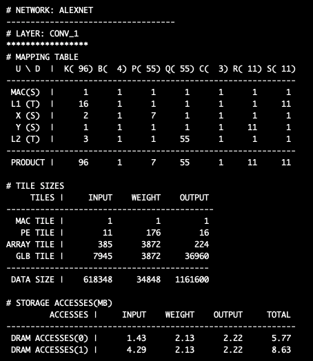

# NeuroSpector

## Build & Run
~~~bash
$ make -j                        # Build
$ ./analyzer.sh                  # Run all layers
$ ./analyzer.sh [layer # > 0]    # Run the selected layer
$ ./analyzer.sh gdb              # Gdb
$ ./optimizer.sh                 # Run all layers
$ ./optimizer.sh [layer # > 0]   # Run the selected layer
$ ./optimizer.sh gdb             # Gdb
~~~

## Configurations
### mappings
for analyzer
### accelerators
for optimizer
### networks
for optimizer

## Mapping table

