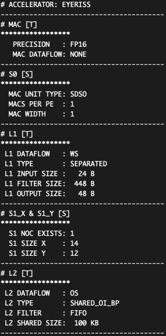
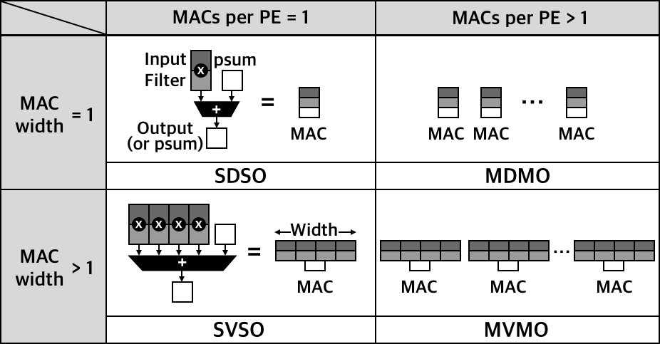
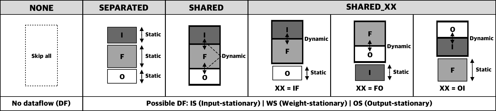
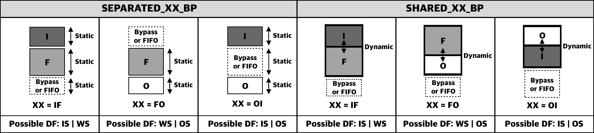
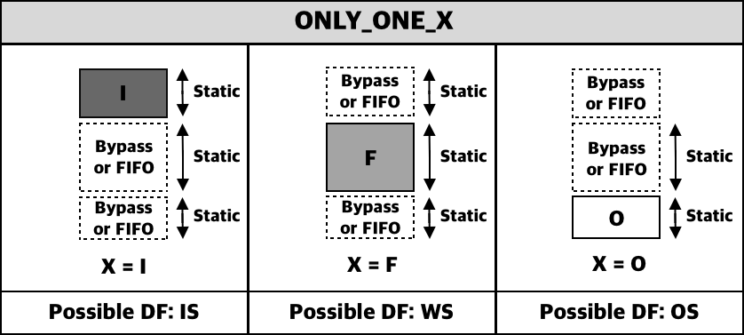

# NeuroSpector Configurations

## 1. Accelerator (./accelerators)
- An accelerator must have at least one MAC unit, and can be configured in various ways with temporal components [T] and spatial arrangement [S].
- Temporal components (e.g., MAC, L1, and L2) can exploit data reuse depending on dataflow types (e.g., IS, WS, and OS). 
- Spatial arrangement (e.g., S0, S1_X, S1_Y, S2) can increase data-level parallelism and computational thorughput.
- [Eyeriss](https://ieeexplore.ieee.org/document/7738524) accelerator example:
  

#### (1) MAC [T]: Multiply-and-accumulate Unit
- Precision: FP8 | FP16 | FP32 | INT8 | INT16 | INT32
~~~
ex) PRECISION,FP16
~~~
- MAC dataflow: IS | WS | NONE (MAC dataflow cannot be OS)
~~~
ex) MAC_DATAFLOW,NONE
~~~

#### (2) S0 [S]: Multiple MACs

- *MACs per PE* and *MAC width* must be positive integer values.
~~~
ex) MACS_PER_PE,1
    MAC_WIDTH,1
~~~

#### (3) L1 [T]: Local buffer in each PE
- L1 dataflow depends on the following L1 buffer type.
~~~
ex) L1_DATAFLOW,WS
~~~
- L1 buffer type:
  - General buffer types: All dataflows are possible except for NONE.
    

    
    - NONE
      ~~~
      ex) L1_TYPE,NONE
      ~~~
    - SEPARATED
      ~~~
      ex) L1_TYPE,SEPARATED,I_SIZE(B),F_SIZE(B),O_SIZE(B)
      ~~~
    - SHARED
      ~~~
      ex) L1_TYPE,SHARED,TOTAL_SIZE(B)
      ~~~
    - SHARED_XX
      ~~~
      ex) L1_TYPE,SHARED_IF,SHARED_SIZE(B),O_SIZE(B)
      ~~~    
  - Bypass one data type: Two dataflows are possible.
    

    
    - SEPARATED_XX_BP
      ~~~
      ex) L1_TYPE,SEPARATED_IF_BP,I_SIZE(B),F_SIZE(B),BYPASS(or FIFO)
      ~~~
    - SHARED_XX_BP
      ~~~
      ex) L1_TYPE,SHARED_IF_BP,SHARED_SIZE(B),BYPASS(or FIFO)
      ~~~    
  - Bypass two data types: Only one dataflow is possible.
    

    
    - ONLY_ONE_X
      ~~~
      ex) L1_TYPE,ONLY_ONE_I,I_SIZE(B),BYPASS(or FIFO)
      ~~~    

#### (4) S1_X & S1_Y [S]: # of multiple PEs
- Communication between PEs: 1 (TRUE) | 0 (FALSE)
~~~
ex) S1_NOC_EXISTS,1
~~~
- Spatial arrangement (X and Y direction)
~~~
ex) S1_X,14
    S1_Y,12
~~~
#### (5) L2 [T]: Global buffer in each accelerator

- L2 buffer type:
  - General buffer types: All dataflows are possible except for NONE.
    - NONE
      ~~~
      ex) L2_TYPE,NONE
      ~~~
    - SEPARATED
      ~~~
      ex) L2_TYPE,SEPARATED,I_SIZE(B),F_SIZE(B),O_SIZE(B)
      ~~~
    - SHARED
      ~~~
      ex) L2_TYPE,SHARED,TOTAL_SIZE(B)
      ~~~
    - SHARED_XX
      ~~~
      ex) L2_TYPE,SHARED_IF,SHARED_SIZE(B),O_SIZE(B)
      ~~~    
  - Bypass one data type: Two dataflows are possible.
    - SEPARATED_XX_BP
      ~~~
      ex) L2_TYPE,SEPARATED_IF_BP,I_SIZE(B),F_SIZE(B),BYPASS(or FIFO)
      ~~~
    - SHARED_XX_BP
      ~~~
      ex) L2_TYPE,SHARED_IF_BP,SHARED_SIZE(B),BYPASS(or FIFO)
      ~~~    
  - Bypass two data types: Only one dataflow is possible.
    - ONLY_ONE_X
      ~~~
      ex) L2_TYPE,ONLY_ONE_I,I_SIZE(B),BYPASS(or FIFO)
      ~~~    

#### (6) S2 [S]: # of multiple accelerators
- Communication between accelerators: 1 (TRUE) | 0 (FALSE)
~~~
ex) S2_NOC_EXISTS,0
~~~
- Spatial arrangement 
~~~
ex) S2,1
~~~

## 2. Mapping Table (./mappings)

## 3. Network (./networks)
